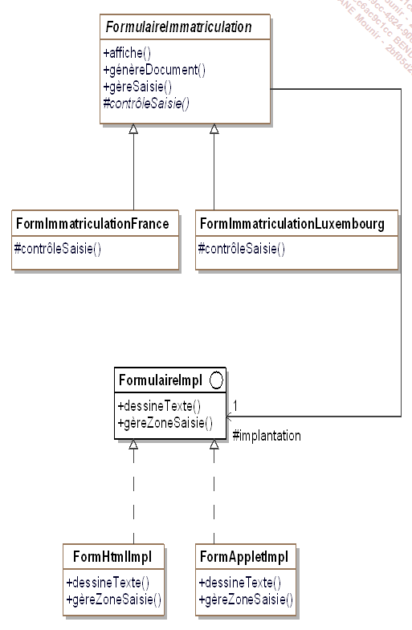
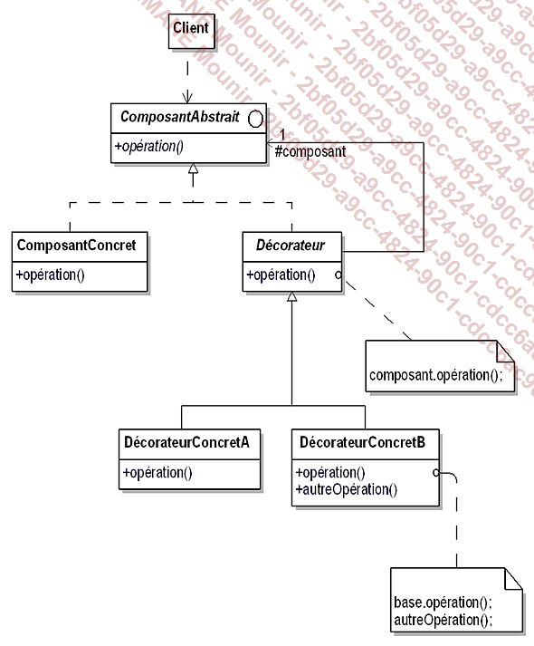
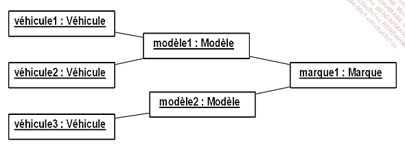
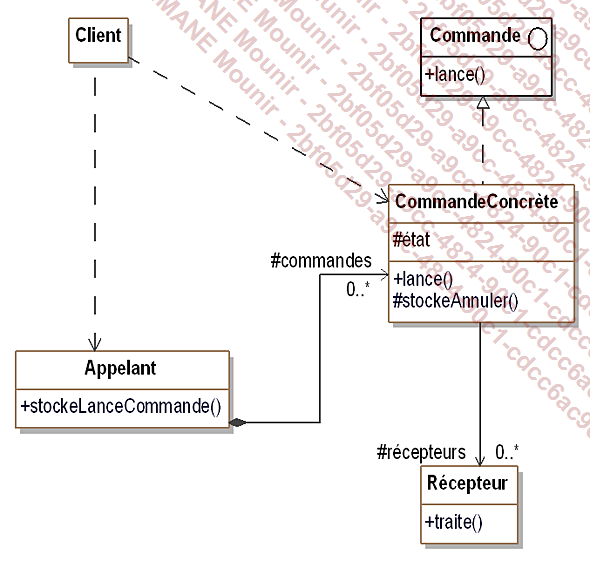

# ESGI_DesignPattern

# Pattern de conception
Les patterns de conception répondent à des problématiques lié à la POO

 

**Catalogue** est un classe pouvant fabriquer des véhicules et contient des objets de type Scooter/Automobile.

**Scooter** est une classe abstraite qui est hérité par 2 classes qui vont la spécialiser.

**ClientVéhicule** est une classe composé de vendeur, constructeur liasse.
ConstructeurLiasseVéhicule est composé de liasse.

le pattern permet aux client de construires les objets qui va compléter ces données. La construction se fait à partir de méthodes qui va instancier les objets et les remplirs. La complétion de l'objet ClientVéhicule se fait graduellement en descendant dans les classe qui le constituent. Ex : **ClientVéhicule** construit un **vendeur** qui construit un **ConstructeurLiasseVéhicule** qui va construire une **liasse**.

  Le pattern FactoryMethode consiste à avoir des méthodes construisant un objet.

  **Singleton** 
  Le pattern Singleton consiste à n'avoir qu'une seule instance d'un objet, cela permet d'économiser de la mémoire.

  **Prototype**
  Le pattern permet de créer des objets à partir d'autre objets appelé prototype avec une méthode clone qui retour un objet identique  

# Pattern de structure ou de structuration

Les patterns de structuration permettent l'indépendance de l'interface d'un objet et son implémentation.  
Les interfaces permettent d'encapsuler la composition des objets.  

Exercice : composition vs héritage en C#  

La composition se base sur un classe qui récupère des méthodes overrides qui ont un traitement proche avec entrées/sorties proches.  

L'héritage se base sur une classe fille qui récupère des méthodes et des attributs d'une classe mère et qui en rajoute pour ce spécialiser.  

  Le but de ce pattern est de convertir l'interface d'une classe donnée en une interface attendue par l'utilisateur

  Sépare le comportement de l'implémentation de l'interface et l'implémentation de l'objet.

  Pattern offrant un cadre de conception d'une composition dont on ne connait pas la profondeur.

  Permet l'ajout dynamique de fonctionnalité supplèmentaire à un objet sans modifier l'interface.

# Pattern comportementaux

  Les patterns de comportement distribuent les algorithmes/traitements entre les objets.  
Ils organisent les interactions en renseignant la "le flux de controle" et traitement au sein d'un système d'objets.

  Le but est de construire une chaine d'objets de manière à ce que si un objet de la chaine ne peut répondre à une requête, il puisse la passer à un "successeur' et ainsi de suite jusqu'à ce que l'un des objets puissent y répondre.

  Transforme une requête en objet ceci facilite les opérations relatives à la requête.